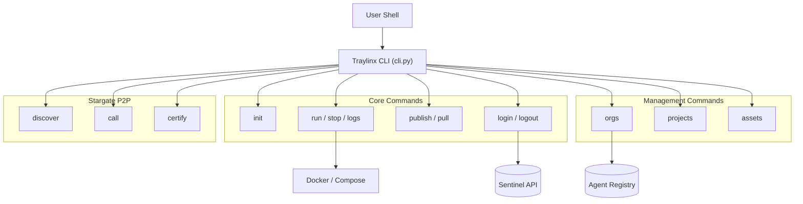

# 🏗️ Traylinx CLI Architecture

The Traylinx CLI is a modular command-line tool built with [Typer](https://typer.tiangolo.com/) and [Rich](https://rich.readthedocs.io/). It features a plugin system for extensibility and Docker-powered agent management.

## 🌟 System Overview



## 🧩 Plugin System

The CLI supports dynamic plugins discovered at runtime.

1.  **Discovery**: On startup, `plugins.py` scans for installed packages prefixed with `traylinx-plugin-`.
2.  **Registration**: Each plugin exports a Typer app that is registered as a sub-command.
3.  **Built-in Plugin**: The `stargate` command group is registered as an internal plugin.

**Installing a Plugin:**
```bash
traylinx plugin install stargate
```

## 📁 Directory Structure

```
traylinx/
├── cli.py            # Main app & callback, registers all commands
├── commands/
│   ├── docker_cmd.py # run, stop, logs, list, publish, pull
│   ├── stargate.py   # discover, call, certify (P2P)
│   ├── auth.py       # login, logout, whoami
│   ├── orgs.py       # Organization management
│   ├── projects.py   # Project CRUD
│   └── ...
├── api/
│   └── registry.py   # HTTPX client for Agent Registry API
├── models/
│   └── manifest.py   # Pydantic models for traylinx-agent.yaml
├── utils/
│   ├── docker.py     # Docker detection, compose helpers
│   └── registry.py   # GHCR push/pull logic
└── templates/        # Jinja2 templates for `traylinx init`
```

## 🔐 Authentication Flow

1.  **Login**: `traylinx login` initiates OAuth Device Flow against **Sentinel**.
2.  **Token Storage**: Credentials are stored in `~/.traylinx/credentials.yaml`.
3.  **Injection**: All authenticated API calls read from the credential store.

---
[⬅️ Back to README](../README.md)
