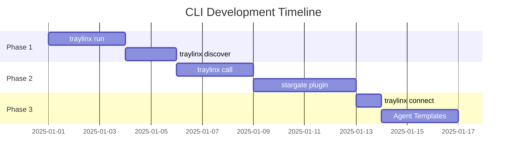

# Traylinx CLI - Implementation Plan

This document outlines the development roadmap for adding Stargate integration to the Traylinx CLI.

---

## Overview

The CLI currently supports basic agent lifecycle management (`init`, `validate`, `publish`). To fully integrate with the Stargate Agent Network, we need to add P2P connectivity, agent discovery, and A2A communication features.

---

## Feature 1: `traylinx run`

**Priority**: 🔴 High  
**Estimated Effort**: 2-3 days

### Purpose
Run an agent locally with automatic Stargate connection to the NATS network.

### Usage
```bash
# Basic
traylinx run

# With options
traylinx run --port 8000 --nats nats://nats.traylinx.com:4222

# With environment
traylinx run --env dev
```

### Implementation

#### File: `traylinx/commands/run.py`
```python
import typer
from rich.console import Console

app = typer.Typer()
console = Console()

@app.command()
def run_command(
    port: int = typer.Option(8000, "--port", "-p", help="Port to run agent on"),
    nats_url: str = typer.Option(None, "--nats", help="NATS server URL"),
    env: str = typer.Option("dev", "--env", "-e", help="Environment"),
    detach: bool = typer.Option(False, "--detach", "-d", help="Run in background"),
):
    """Run agent locally with Stargate connection."""
    # 1. Load manifest
    # 2. Validate manifest
    # 3. Connect to Stargate (NATS)
    # 4. Register with local registry
    # 5. Start agent server
    # 6. Handle graceful shutdown
```

#### Dependencies
- `traylinx-stargate` (PyPI package)
- `uvicorn` for serving
- Agent manifest file (`traylinx-agent.yaml`)

#### Steps
1. Create `run.py` command file
2. Add Stargate client integration
3. Implement NATS connection handling
4. Add graceful shutdown (SIGINT/SIGTERM)
5. Add `--watch` mode for development
6. Register command in `cli.py`

---

## Feature 2: `traylinx discover`

**Priority**: 🔴 High  
**Estimated Effort**: 1-2 days

### Purpose
Discover agents on the Stargate network by capability or name.

### Usage
```bash
# List all agents
traylinx discover

# Filter by capability
traylinx discover --capability web_search

# Filter by name pattern
traylinx discover --name "search*"

# Output format
traylinx discover --format json
```

### Implementation

#### File: `traylinx/commands/discover.py`
```python
@app.command()
def discover_command(
    capability: str = typer.Option(None, "--capability", "-c"),
    name: str = typer.Option(None, "--name", "-n"),
    format: str = typer.Option("table", "--format", "-f"),
):
    """Discover agents on the Stargate network."""
    # 1. Connect to registry API
    # 2. Query agents with filters
    # 3. Display results
```

#### API Endpoint
```
GET /a2a/catalog/agents?capability={cap}&name={name}
```

#### Steps
1. Create `discover.py` command
2. Add registry API method `list_agents()`
3. Implement table/json output formatting
4. Add caching for performance
5. Register command in `cli.py`

---

## Feature 3: `traylinx call`

**Priority**: 🔴 High  
**Estimated Effort**: 2-3 days

### Purpose
Make A2A RPC calls to other agents from the command line.

### Usage
```bash
# Basic call
traylinx call search-agent --action search --payload '{"query": "AI news"}'

# From file
traylinx call translate-agent --action translate --payload-file request.json

# Stream response
traylinx call cortex-agent --action chat --payload '{"message": "Hello"}' --stream
```

### Implementation

#### File: `traylinx/commands/call.py`
```python
@app.command()
def call_command(
    agent: str = typer.Argument(help="Agent key to call"),
    action: str = typer.Option(..., "--action", "-a"),
    payload: str = typer.Option(None, "--payload", "-p"),
    payload_file: Path = typer.Option(None, "--payload-file", "-f"),
    stream: bool = typer.Option(False, "--stream", "-s"),
    timeout: int = typer.Option(30, "--timeout", "-t"),
):
    """Call another agent via A2A RPC."""
    # 1. Build A2A envelope
    # 2. Route via router or direct
    # 3. Display response
```

#### Steps
1. Create `call.py` command
2. Add A2A RPC client
3. Support streaming responses
4. Add response formatting (json, pretty)
5. Handle errors gracefully
6. Register command in `cli.py`

---

## Feature 4: Stargate Plugin

**Priority**: 🔴 High  
**Estimated Effort**: 3-4 days

### Purpose
Modular plugin to add all Stargate-related functionality.

### Installation
```bash
traylinx plugin install stargate
```

### Plugin Structure
```
traylinx-stargate-plugin/
├── pyproject.toml
├── traylinx_stargate_plugin/
│   ├── __init__.py
│   ├── commands/
│   │   ├── run.py
│   │   ├── discover.py
│   │   ├── call.py
│   │   └── connect.py
│   └── client.py       # Stargate client wrapper
```

### Plugin Entry Point
```toml
# pyproject.toml
[project.entry-points."traylinx.plugins"]
stargate = "traylinx_stargate_plugin:app"
```

### Steps
1. Create new repo `traylinx-stargate-plugin`
2. Implement plugin structure
3. Add `traylinx-stargate` as dependency
4. Implement all Stargate commands
5. Publish to PyPI
6. Test plugin discovery

---

## Feature 5: `traylinx connect`

**Priority**: 🟡 Medium  
**Estimated Effort**: 1 day

### Purpose
Connect to NATS cluster for debugging and monitoring.

### Usage
```bash
# Interactive NATS shell
traylinx connect

# Subscribe to topic
traylinx connect --subscribe "agent.>"

# Publish message
traylinx connect --publish "agent.test" --message "hello"
```

### Steps
1. Create `connect.py` command
2. Add NATS connection handling
3. Implement pub/sub commands
4. Add interactive mode
5. Register command

---

## Feature 6: Additional Agent Templates

**Priority**: 🟡 Medium  
**Estimated Effort**: 2-3 days

### Purpose
Provide more starter templates for common agent types.

### Templates
```bash
traylinx init my-agent --template search      # Web search agent
traylinx init my-agent --template translate   # Translation agent
traylinx init my-agent --template upload      # File upload agent
traylinx init my-agent --template chat        # Chat agent
```

### Steps
1. Create template directories in `traylinx/templates/`
2. Add template-specific files
3. Update `init.py` to support template selection
4. Add template listing command

---

## Implementation Order



| Phase | Feature | Est. Days | Dependencies |
|-------|---------|-----------|--------------|
| 1 | `traylinx run` | 3 | traylinx-stargate (PyPI) |
| 1 | `traylinx discover` | 2 | Agent Registry deployed |
| 2 | `traylinx call` | 3 | Router Agent deployed |
| 2 | `stargate` plugin | 4 | All Phase 1 features |
| 3 | `traylinx connect` | 1 | NATS deployed |
| 3 | Agent Templates | 3 | None |

**Total Estimated Effort**: 16 days

---

## Dependencies

Before implementing these features, ensure:

1. **NATS Cluster** - Deployed and accessible
2. **Agent Registry** - Deployed with `/a2a/catalog/*` endpoints
3. **traylinx-stargate** - Published to PyPI
4. **Router Agent** - Deployed for A2A routing

---

## Testing Plan

| Feature | Unit Tests | Integration Tests |
|---------|------------|-------------------|
| `run` | Mock Stargate client | Local agent + NATS |
| `discover` | Mock registry API | Real registry query |
| `call` | Mock A2A responses | Agent-to-agent call |
| `connect` | Mock NATS | Real NATS pub/sub |

---

## Next Steps

1. [ ] Deploy NATS cluster
2. [ ] Publish traylinx-stargate to PyPI
3. [ ] Implement `traylinx run`
4. [ ] Implement `traylinx discover`
5. [ ] Implement `traylinx call`
6. [ ] Create stargate plugin
7. [ ] Add more templates
